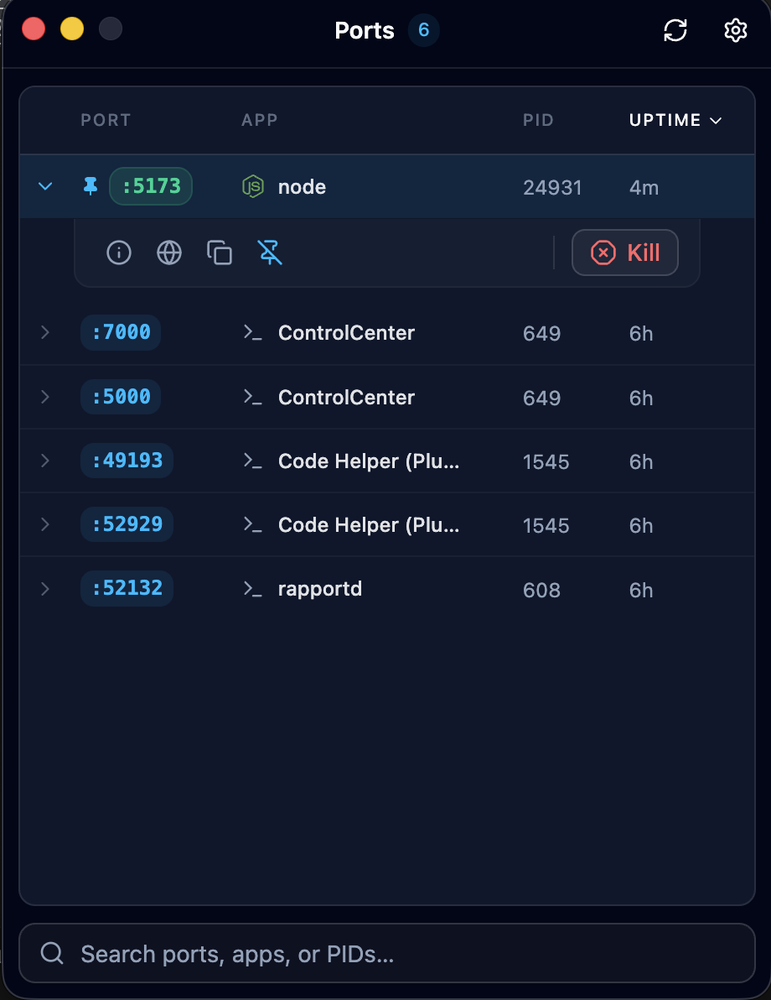

# Port Monitor

A tiny macOS app to see what's listening on your ports - and kill it in one click.

No more `lsof -i :3000` then `kill -9`. Open the app, find the port, done.

<p align="center">
  
</p>

## Features

- 🔌 **Live port list** — every listening TCP port, the app behind it, PID, and uptime
- ⚡ **One-click kill** — terminate a process straight from the row (with confirm)
- 🔎 **Instant search** — filter by port, app name, or PID
- 📌 **Pin ports** — keep your dev ports (3000, 5432, …) at the top
- 🎨 **App icons** — recognizes node, Docker, Postgres, Redis, nginx, and more
- 🔄 **Auto-refresh** — configurable interval, or refresh on demand
- 🌗 **Light / dark / system** theme
- ⌨️ **Global shortcut** — `⌘⇧9` to toggle the popup from anywhere
- 🗂️ **Actions** — view details, open in browser, copy the kill command

## Install

### Homebrew (recommended)

```bash
brew tap derenko404/tap
brew trust derenko404/tap   # one-time: trust a third-party tap
brew install --cask port-monitor
```

Update later:

```bash
brew upgrade --cask port-monitor
```

### Manual

1. Download the latest `.dmg` for your chip from [Releases](https://github.com/derenko404/port-monitor-app/releases):
   - Apple Silicon → `port-monitor-<version>-arm64.dmg`
   - Intel → `port-monitor-<version>-x64.dmg`
2. Open the dmg, drag **Port Monitor** to Applications.

### First launch

The app isn't signed to run locally (no paid Apple Developer cert), so macOS blocks
it the first time — whether installed via Homebrew or manually. Clear quarantine once from Terminal, then open it normally:

```bash
xattr -dr com.apple.quarantine "/Applications/Port Monitor.app"
```

You only do this once per install.

## Usage

Port Monitor only sees processes your user can access (same as `lsof` without `sudo`).

## Development

Requires Node 22+.

```bash
git clone https://github.com/derenko404/port-monitor-app.git
cd port-monitor-app
npm install
npm run dev          # launch with hot reload
```

Useful scripts:

```bash
npm run typecheck    # tsc, main + renderer
npm run lint         # eslint
npm run build        # typecheck + bundle
npm run build:mac    # produce a local .dmg
```

## Tech stack

- [Electron](https://www.electronjs.org/) + [electron-vite](https://electron-vite.org/)
- [React](https://react.dev/) + [TypeScript](https://www.typescriptlang.org/)
- [Tailwind CSS](https://tailwindcss.com/) + [shadcn/ui](https://ui.shadcn.com/)
- [TanStack Table](https://tanstack.com/table) · [Jotai](https://jotai.org/) · [React Router](https://reactrouter.com/)
- Port data via `lsof` / `ps`

## Releasing

Releases are automated. Cut one with:

```bash
npm run release      # bumps version, updates CHANGELOG, tags, pushes
```

Pushing a `v*` tag triggers the GitHub Action, which builds the arm64 + x64
dmgs and attaches them to the release.

## Contributing

Issues and PRs welcome. Commits follow
[Conventional Commits](https://www.conventionalcommits.org/) (`feat:`, `fix:`, `chore:` …)
so the changelog and version bumps stay automatic.

## License

MIT
